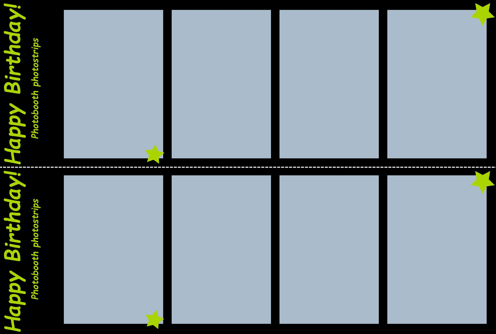

# photobooth

Disclaimer:

_The original `README.md` can be found [here](./README.old.md) with credits to @reuterbal for the original development of this software and to @andyboeh, @tammtimmer, @t0mmo for additional features. As of `2022-07-31`, there has not been any changes since 3 years and I therefore regard it as abandoned._

A flexible Photobooth software.

It supports many different camera models, the appearance can be adapted to your likings, and it runs on many different hardware setups.

## Description

This is a Python application to build your own photobooth.

### Features

* Capture a single or multiple pictures and assemble them in an m-by-n grid layout
* Live preview during countdown
* Store assembled pictures (and optionally the individual shots)
* Printing of captured pictures (via Qt printing module or pycups)
* Highly customizable via settings menu inside the graphical user interface
* Custom background for assembled pictures
* Ability to skip single pictures in the m-by-n grid (e.g., to include a logo in the background image)
* Support for external buttons and lamps via GPIO interface
* Rudimentary WebDAV upload functionality (saves pictures to WebDAV storage) and mailer feature (mails pictures to a fixed email address)
* Theming support using [Qt stylesheets](https://doc.qt.io/qt-5/stylesheet-syntax.html)

### Screenshots

Screenshots produced using `CameraDummy` that produces unicolor images.

#### Theme _pastel_

    

#### Theme _dark_

   

### Fancy Templates

The templates are defined in XML. The XML file descibes size&color of the background. On top each XML tag adds an element on top of the others:

* `Image` can be PNG (incl transparency if required) or JPG etc and should be the same size like defined in the background. Can be used for a picture background or final overlay ontop of photos.
* `Photo` refers to a shot taken by the camera. Positioning, resizing, rotation are supported currently. Make sure shots are numbered correctly!

Currently, three examples are provided:

* `standard_2x2.xml` mimics the current behaviour of composing 2x2 photos on a white back. 
* `example.xml` is a showcase for current capabilities (sorry for my limited design skills). Curious to see what others come up with! 
* `photostrips.xml` is another showcase for what's possible 

To test & develop further templates the templating can be called directly from the CLI:

```bash
python -m photobooth.template.FancyTemplate -t .\supplementals\templates\example.xml
```

`-h` provides a short help

### Technical specifications

* Many camera models supported, thanks to interfaces to [gPhoto2](http://www.gphoto.org/), [OpenCV](https://opencv.org/),  [Raspberry Pi camera module](https://projects.raspberrypi.org/en/projects/getting-started-with-picamera)
* Tested on Standard x86 hardware and [Raspberry Pi](https://raspberrypi.org/) models 1B+, 2B, 3B, 3B+, 4 and 400
* Flexible, modular design: Easy to add features or customize the appearance
* Multi-threaded for responsive GUI and fast processing
* Based on [Python 3](https://www.python.org/), [Pillow](https://pillow.readthedocs.io), and [Qt5](https://www.qt.io/developers/)

## Installation and usage

### Hardware requirements

* Some computer/SoC that is able to run Python 3.5+ as well as any of the supported camera libraries
* Camera supported by gPhoto 2 (see [compatibility list](http://gphoto.org/proj/libgphoto2/support.php)), OpenCV (e.g., most standard webcams), or a Raspberry Pi Camera Module.
* Optional: External buttons and lamps (in combination with gpiozero-compatible hardware)

### Installing and running the photobooth

See [installation instructions](INSTALL.md).

## Configuration and modifications

Default settings are stored in [`photobooth/defaults.cfg`](photobooth/defaults.cfg) and can either be changed in the graphical user interface or by creating a file `./photobooth.cfg` in the top folder and overwriting your settings there.

The software design is very modular.
Feel free to add new postprocessing components, a GUI based on some other library, etc.

## Feedback and bugs

I appreciate any feedback or bug reports.
Please submit them via the [Issue tracker](https://github.com/miaucl/photobooth/issues/new?template=bug_report.md) and always include your `photobooth.log` file (is created automatically in the top folder) and a description of your hardware and software setup.

I am also happy to hear any success stories! Feel free to [submit them here](https://github.com/miaucl/photobooth/issues/new?template=success-story.md).

## Other interesting PRs

- tammtimmer:slideshow

## License

I provide this code under AGPL v3. See [LICENSE](https://github.com/miaucl/photobooth/blob/master/LICENSE.txt).
